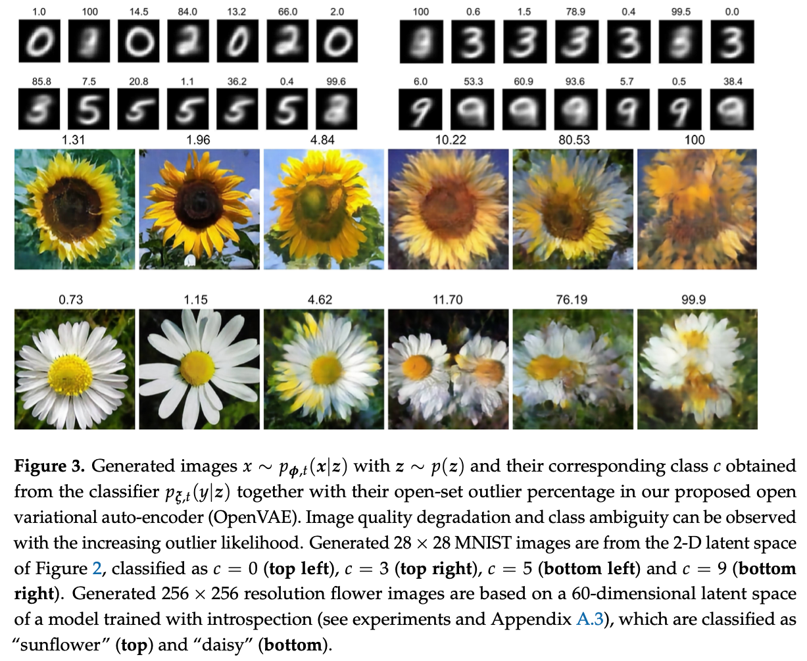
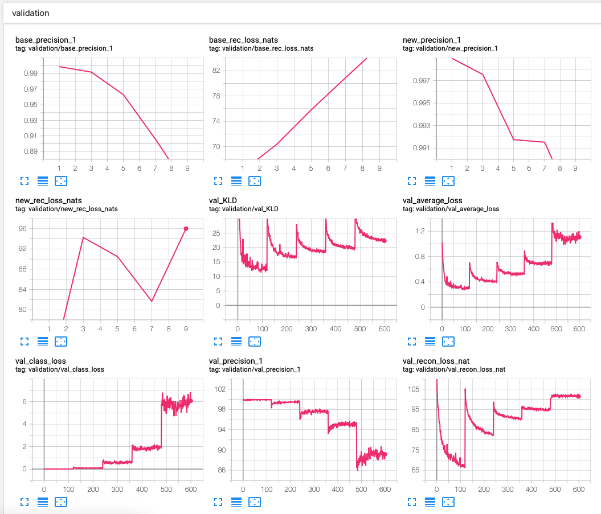

# Code for our paper Unified Probabilistic Deep Continual Learning through Generative Replay and Open Set Recognition

This repository contains PyTorch code for our [paper](https://www.mdpi.com/2313-433X/8/4/93
):

> **Martin Mundt, Iuliia Pliushch, Sagnik Majumder, Yongwon Hong, and Visvanathan Ramesh:
> *"Unified Probabilistic Deep Continual Learning through Generative Replay and Open Set Recognition"*, Journal of Imaging. 2022; 8(4):93. 
> https://doi.org/10.3390/jimaging8040093**

published as part of the special issue on Continual Learning in Computer Vision: Theory and Applications in Journal of Imaging. 

The code implements our proposed approach to unify the prevention of catastrophic interference in continual learning with the recognition of unknown data instances (out-of-distribution detection or open set recognition) on the basis of the aggregate posterior in variational inference with deep variational auto-encoders. Respectively, we name our approach OpenVAE. 

In addition to our own contributions, we provide code for our abstract dataset class, that converts any existing (PyTorch) classification dataset into a class incremental scenario. 

Recall that the key to our approach is the use of extreme value theory on the basis of the aggregate posterior in a deep VAE, which is optimized for the joint distribution p(x,y). With the mechanisms established in the paper, we can conveniently assign an outlier probability to a novel instance or analogously to randomly drawn samples used for generation. 

## Requirements

We list our main python packages that are required. In principle our code should work with many different versions. To allow for full reproducibility at later points in time, we also add a pip freeze `requirements.txt` for our machine's exact configuration at the point of writing the paper. Not all of these libraries are needed and the critical libraries that we use are:

* Python 3 (3.5.2)
* PyTorch 1.3.1 & torchvision 0.4.2 
* Cython >= 0.17 (for libmr) & libmr 0.1.9 (for open set recognition)
* tqdm 4.17.1 (for progress bars)
* scipy 1.2.1 & librosa 0.6.3 (for creation of AudioMNIST spectrograms)
	
and for visualization:

* Matplotlib 3.0.2
* Seaborn 0.8.1
* Tensorboard 2.0.1

## Running experiments - command line parser
We have added a command line parser in `lib/cmdparser.py`. There are a variety of options that can be specified. The large majority is also set to a sensible default value and doesn't need to be touched to reproduce the results of our paper. All the options, together with a help dialogue can be printed with:

	python3 main.py --help

We will describe the most important options that can be used for the various experimental settings below. 

In the code we have added docstrings to each function and class, specifying what is being done, what the arguments are, what attributes a class has and what is returned. 

### Choice of datasets
By default the MNIST dataset is being loaded and a wide residual network (WRN) is trained for 120 epochs in an isolated fashion (i.e. on all data at once, without any continuous learning).

The dataset can be changed with the `--dataset` option (MNIST, AudioMNIST, FashionMNIST, KMNIST, CIFAR10, CIFAR100 and SVHN are implemented, derived from torchvision):

	python3 main.py --dataset FashionMNIST
	
The flower dataset also has a dataloader, but the data needs to be first downloaded from the following website: https://www.robots.ox.ac.uk/~vgg/data/flowers/ . For our dataloader, it is assumed that the 5 class version, consisting of "sunflower, daisy, iris, daffodil and pansy" is copied to `datasets/flower_data/5flowers_class/`. 
	
### Continual training and prevention of catastrophic interference 
To automatically generate continual learning scenarios, we have created an incremental data class, that inherits from any of the specified datasets.  
We can specify its use with the `--incremental-data True` option. This will split the given dataset into the individual classes and automatically add a new increment of classes at the end of the specified amount of epochs before continuing to train. The number of initial increments can be set with the `--num-base-tasks` argument and the number of class increments can be set via `--num-increment-tasks`. The order of the increments is sequential by default but can be randomized with `--randomize-task-order True` or loaded from an array with `--load-task-order path`. 
As specified in the paper, there are 4 general scenarios to choose from by setting: 
	
* `--incremental-data True`: this can be seen as a continual learning lower bound, i.e. a simple fine-tuning, and the model will only be trained on the most recent increment's real data.
* `--incremental-data True --train-incremental-upper-bound True`: this is the incremental upper bound, i.e. the maximum achievable performance of a model given the hyper-parameter setting, where each task increment adds real data and the existing previous real data is kept.
* `--incremental-data True --generative-replay True`: This corresponds to a VAE model where old tasks are rehearsed using generative replay with conventional sampling from the prior. 
* `--incremental-data True --openset-generative-replay True`: Our proposed approach using open set recognition on the basis of the aggregate posterior (OpenVAE). Uses generative replay with statistical outlier rejection for improved rehearsal of previously seen data distributions. 

We note that test sets always consist of real data. 
	
A different datasets can easily be added by following the conventions in `lib/Datasets/datasets.py` and creating a class for each new dataset. The continual learning incremental_dataset.py classes should take care of the rest automatically.

### Neural network architecture
The default model is a wide residual network, as evaluated towards the end of our paper (with command line options for embedding size, layer width and architecture depth). In order to be able to use the code if less compute is available, and reproduce our MLP experiments, there is also the smaller `MLP` in `lib/Models/architectures.py`. The model can be selected with:

	python3 main.py -a WRN

Our default latent dimensionality is 60, with one sample z being drawn per data point during training (as is typical in the VAE literature). We have added the options to change this with:

	python3 main.py --var-latent-dim 60 --var-samples 1
	
Our generative models can be turned into their autoregressive counterparts with the boolean `--autoregression` option. There are further options for setting the amount of channels of the autoregressive decoder, number of layers and kernel sizes, should the user wish to modify this from what has been used in the paper.

	python3 main.py --autoregression True --out-channels 60 --pixel-cnn-channels 60 --pixel-cnn-layers 3 --pixel-cnn-kernel-size 7
	
Similarly, the introspection version can be turned on with:

	python3 main.py -introspection True 

We emphasize that this does not induce any modification to the architecture (in contrast to autoregression), but simply reuses the encoder to compute an adversarial loss during training.

We point to our paper's appendix for a summary of autoregression and introspection.
	
### Logging and visualization
We save visualizations, command line parameters, optimizers and models at every continual learning step to an automatically generated (time-stamped) folder on hard-drive.

In addition, we add this information to a respective TensorBoard instance. This TensorBoard log file also contains all history of losses and our more detailed continual learning metrics, as described in the paper's appendix. Each experiment generates a new folder that contains the major important command line options in its name and a time stamp to quickly distinguish experiments. A full specification of command line arguments is further saved to file and to the TensorBoard text tab.

You can visualize the TensorBoard log by pointing to the automatically generated runs/ folder:

	tensorboard --logdir runs/
	
A screenshot of a Tensorboard example for the validation metrics of a continually trained MLP on MNIST can be found below: 
	

	
## Standalone script for open set evaluation with a trained model
We provide a separate standalone script to simply evaluate open set dataset outlier rejection rates on an already trained model by specifying the dataset it has been trained on and choosing unseen datasets to evaluate on.  

The script is called `eval_openset.py` and uses the same command line parser. The `--resume path/to/model.pth.tar` option needs to be specified to load an already trained model. It will print inlier percentages and outlier percentages for all specified datasets and methods in the paper, as well as produce corresponding figures.

The open set datasets can be specified in a comma separated string as shown in the following example:

	python3 eval_openset.py --resume <path/to/model> --openset-datasets 'FashionMNIST,AudioMNIST,CIFAR10,CIFAR100,SVHN'

In addition you can optionally specify number of samples to draw `--var-samples`.
 
Note that for a large number of samples, our Weibull EVT approach (sitting directly on z) is very fast to compute. The predictive entropy of the classifier is similarly quick to compute as it consists of only additional matrix multiplication. However, to use reconstruction loss to distinguish datasets implies recalculating the entire decoder for every sample (batch). We have thus added an extra command line option named `--calc-reconstruction` that can be set to `True`. If this calculation is desired for reasons of comparison and reproducing the figures and tables in the paper. Here is an example, averaged over 100 samples:

	python3 eval_openset.py --resume <path/to/model> --openset-datasets 'FashionMNIST,AudioMNIST,CIFAR10,CIFAR100,SVHN' --var-samples 100 --calc-reconstruction True

