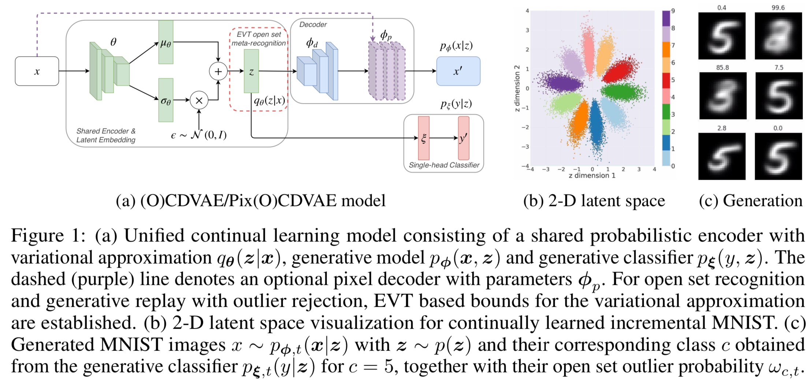

# Code for our paper Unified Probabilistic Deep Continual Learning through Generative Replay and Open Set Recognition

This repository contains PyTorch code for our [paper](https://arxiv.org/abs/1905.12019
):

> **Martin Mundt, Sagnik Majumder, Iuliia Pliushch and Visvanathan Ramesh:
> *"Unified Probabilistic Deep Continual Learning through Generative Replay and Open Set Recognition"*
> https://arxiv.org/abs/1905.12019**

The code implements our proposed unified (O)CDVAE model with growing single-head classifier (see figure 1a), the open set recognition mechanism based on the approximate posterior (see latent space in figure 1b, making the CDVAE an OCDVAE model) and generative replay with statistical outlier rejection (see figure 1c) for continual learning. We further provide code for our abstract dataset classes that can convert existing datasets to class incremental continual learning scenarios or cross-dataset continual learning settings.

## Requirements

We list our main python packages that are required. In principle our code should work with many different versions. To allow for full reproducibility at later points in time, we also add a pip freeze `requirements.txt` for our machine's exact configuration at the point of writing the paper. Not all of these libraries are needed and the critical libraries that we use are:

* Python 3 (3.5.2)
* PyTorch 1.3.1 & torchvision 0.4.2 
* Cython >= 0.17 (for libmr) & libmr 0.1.9 (for open set recognition)
* tqdm 4.17.1 (for progress bars)
* scipy 1.2.1 & librosa 0.6.3 (for creation of AudioMNIST spectrograms)
	
and for visualization:

* Matplotlib 3.0.2
* Seaborn 0.8.1
* Tensorboard 2.0.1

## Running experiments - command line parser
We have added a command line parser in `lib/cmdparser.py`. There is a variety of options that can be specified. The large majority is also set to a sensible default value and doesn't need to be touched to reproduce the results of our paper. All the options, together with a help dialogue can be printed with:

	python3 main.py --help

We will describe the most important options that can be used for the various experimental settings below. 

In the code we have added docstrings to each function and class, specifying what is being done, what the arguments are, what attributes a class has and what is returned. 

### Continual learning and choice of datasets
By default the MNIST dataset is being loaded and a wide residual network (WRN) based CDVAE is trained for 120 epochs in an isolated fashion.

The dataset can be changed with the `--dataset` option (MNIST, AudioMNIST and FashionMNIST are implemented):

	python3 main.py --dataset FashionMNIST
	
If we wish to train the various continual learning scenarios we can further specify these with the `--incremental-data` option. This will split the given dataset into the individual classes and add a new increment of classes at the end of the specified amount of epochs before continuing to train. The number of initial increments can be set with the `--num-base-tasks` argument and the number of class increments can be set via `--num-increment-tasks`. The order of the increments is sequential by default but can be randomized with `--randomize-task-order True` or loaded from an array with `--load-task-order path`. 
As specified in the paper, there is 4 different scenarios to choose from by setting: 
	
* `--incremental-data True`: this is the incremental lower bound and the model will only be trained on the most recent increment's real data.
* `--incremental-data True --train-incremental-upper-bound True`: this is the incremental upper bound, i.e. the maximum achievable performance of a model given the hyper-parameter setting, where each task increment adds real data and the existing previous real data is kept.
* `--incremental-data True --generative-replay True`: This corresponds to a CDVAE model where old tasks are rehearsed using generative replay with conventional sampling from the prior. 
* `--incremental-data True --openset-generative-replay True`: Our proposed approach using open set recognition with the OCDVAE. Uses generative replay with statistical outlier rejection for improved rehearsal of previously seen data distributions. 

We note that validation sets always consist of real data. 

For the cross-dataset scenario there is an additional boolean flag called `--cross-dataset` and an argument to specify the dataset order as a comma separated string `--dataset-order`. The default order is AudioMNIST -> MNIST -> FashionMNIST (one of the experiments in the paper):

	python3 main.py --incremental-data True --cross-dataset True --num-base-tasks 1 --num-increment-tasks 1 --dataset-order "AudioMNIST, MNIST, FashionMNIST"
	
A different datasets can easily be added by following the conventions in `lib/Datasets/datasets.py` and creating a class for each new dataset. The continual learning incremental_dataset.py classes should take care of the rest automatically.

### Models
The default model is a wide residual network based CDVAE as evaluated in the paper (with command line options for embedding size, layer width and architecture depth). In order to be able to use the code if less compute is available, we have also added a smaller `MLP` and a shallower CNN called `DCNN` to `lib/Models/architectures.py`. Both of them similarly illustrate the effects mentioned in the paper, but with worse overall final performance. The model can be selected with:

	python3 main.py -a WRN

All our models are variational and our default latent dimensionality is 60, with one sample z being drawn per data point during training (as is typical in the VAE literature). We have added the options to change this with:

	python3 main.py --var-latent-dim 60 --var-samples 1
	
Our (O)CDVAE models can be turned into their autoregressive counterparts with the boolean `--autoregression` option. There is further options for setting the amount of channels of the autoregressive decoder, number of layers and kernel sizes. 

	python3 main.py --autoregression True --out-channels 60 --pixel-cnn-channels 60 --pixel-cnn-layers 3 --pixel-cnn-kernel-size 7
	
### Logging and visualization
We save visualizations to a folder on hard-drive and add them to the respective TensorBoard instance. This TensorBoard log file also contains all history of losses and our continual learning metrics as described in the paper. Each experiment generates a new folder that contains the major important command line options in its name and a time stamp to quickly distinguish experiments. A full specification of command line arguments is further saved to file and to the TensorBoard text tab.

You can visualize the TensorBoard log by pointing to the automatically generated runs/ folder:

	tensorboard --logdir runs/
	
## Standalone script for open set dataset evaluation with a trained model
We provide a separate standalone script to simply evaluate open set dataset outlier rejection rates on an already trained model by specifying the dataset it has been trained on and choosing unseen datasets to evaluate on. The script is called `eval_openset.py` and uses the same command line parser. The `--resume path/to/model.pth.tar` option needs to be specified to load an already trained model. It will print inlier percentages and outlier percentages for all specified datasets and methods in the paper, as well as produce corresponding figures.

The open set datasets can be specified in a comma separated string as shown in the following example:

	python3 eval_openset.py --resume <path/to/model> --openset-datasets 'FashionMNIST,AudioMNIST,CIFAR10,CIFAR100,SVHN'

In addition you can optionally specify number of samples to draw from the approximate posterior `--var-samples` and the option to evaluate the out-of-distribution detection using reconstruction loss. Note that for a large number of samples, our Weibull EVT approach (sitting directly on z) is very fast to compute. The predictive entropy of the classifier is similarly quick to compute as it consists of only additional matrix multiplication. However, to use reconstruction loss to distinguish datasets implies recalculating the entire decoder for every sample (batch). We have thus added an extra command line option named `--calc-reconstruction` that can be set to `True` if this calculation is desired for reasons of comparison and reproducing the figures and tables in the paper. Here is an example, averaged over 100 samples as reported in the paper:

	python3 eval_openset.py --resume <path/to/model> --openset-datasets 'FashionMNIST,AudioMNIST,CIFAR10,CIFAR100,SVHN' --var-samples 100 --calc-reconstruction True
	

